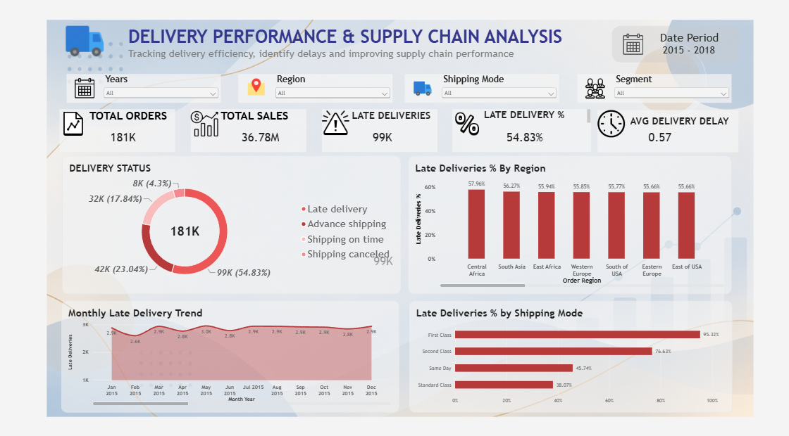

# 🚚 Delivery Performance & Supply Chain Analysis

An end-to-end Data Analytics project analyzing delivery performance and supply chain operations using **Python, MySQL, and Power BI**.

> **Business question:** Why are customer orders being delivered late, and what factors are responsible for poor delivery performance?

## 📊 Dashboard Preview



## 🎯 Project Objective

This project analyzes historical supply chain data to identify:
- The scale of late deliveries
- Regions with higher delivery risk
- Shipping modes with poor delivery performance
- Product categories experiencing delivery issues
- Customer segments affected by delays
- The difference between actual and scheduled shipping time
- Monthly changes in delivery performance
- Regions with both high sales and high delivery risk

## 🗂️ Dataset

**DataCo SMART SUPPLY CHAIN FOR BIG DATA ANALYSIS**

Source: [Kaggle – DataCo SMART SUPPLY CHAIN FOR BIG DATA ANALYSIS](https://www.kaggle.com/datasets/shashwatwork/dataco-smart-supply-chain-for-big-data-analysis)

Main file: `DataCoSupplyChainDataset.csv`

- 180,519 records
- 53 original columns
- Date range: January 2015 – January 2018

The original dataset is not included in this repository because of its size. The Kaggle source is provided above.

---

# 🔄 End-to-End Workflow

```text
Raw Kaggle Dataset
        ↓
Python Data Cleaning
        ↓
Feature Engineering
        ↓
Exploratory Data Analysis
        ↓
Cleaned Dataset
        ↓
MySQL
        ↓
SQL Business Analysis
        ↓
Power BI Data Model
        ↓
DAX Measures
        ↓
Interactive Dashboard
        ↓
Business Insights & Recommendations
```

# 🐍 1. Python — Data Cleaning & EDA

Python and Pandas were used for data preparation and exploratory analysis.

## Data loading

```python
import pandas as pd

df = pd.read_csv(
    "DataCoSupplyChainDataset.csv",
    encoding="latin1"
)
```

Original dataset:
- 180,519 rows
- 53 columns

## Data quality checks

The dataset was checked for missing values, duplicates, data types, delivery status, order status, shipping modes, and shipping-time statistics.

Duplicate rows:

```text
0
```

## Missing values

| Column | Missing Values |
|---|---:|
| Customer Lname | 8 |
| Customer Zipcode | 3 |
| Order Zipcode | 155,679 |
| Product Description | 180,519 |

`Product Description` was completely missing and was not required for the analysis.

## Columns removed

```text
Customer Email
Customer Password
Customer Fname
Customer Lname
Customer Street
Customer Zipcode
Order Zipcode
Product Description
Product Image
```

After cleaning:

```text
180,519 rows
44 columns
```

## Delivery status

| Delivery Status | Orders |
|---|---:|
| Late delivery | 98,977 |
| Advance shipping | 41,592 |
| Shipping on time | 32,196 |
| Shipping canceled | 7,754 |

## Delivery Delay

A `Delivery Delay` feature was created:

```python
df_clean["Delivery Delay"] = (
    df_clean["Days for shipping (real)"]
    - df_clean["Days for shipment (scheduled)"]
)
```

Interpretation:
- Negative → faster than scheduled
- 0 → on schedule
- Positive → longer than scheduled

A positive delay is not automatically treated as a late-delivery status because cancelled shipments can also have positive delay values.

## Date analysis

`order date (DateOrders)` was converted to datetime and additional fields were created:

- `order_month`
- `order_year`
- `order_month_year`

Date range:

```text
2015-01-01 → 2018-01-31
```

## Python EDA

The analysis covered:
- Late deliveries by region
- Late deliveries by shipping mode
- Late deliveries by product category
- Late deliveries by customer segment
- Monthly late-delivery trend
- Actual vs scheduled shipping time
- Late-delivery rate by shipping mode
- Late-delivery rate by region
- Late-delivery rate by category
- Late-delivery rate by customer segment
- Overall delivery-status distribution

# 🗄️ 2. MySQL — Business Analysis

The cleaned dataset was imported into MySQL using the main table:

```text
delivery_data_clean
```

`Delivery Delay` was also added to the SQL table.

## Basic SQL analysis

SQL was used to calculate:
- Total orders
- Orders by delivery status
- Orders by shipping mode
- Orders by customer segment
- Orders by region
- Orders by category
- Total sales
- Average sales
- Minimum and maximum sales
- Average actual shipping time
- Average scheduled shipping time

Example:

```sql
SELECT COUNT(*) AS total_orders
FROM delivery_data_clean;
```

## Intermediate SQL analysis

The project analyzed:
- Late deliveries by region
- Late-delivery rate by region
- Late-delivery rate by shipping mode
- Late deliveries by category
- Late-delivery rate by category
- Late-delivery rate by customer segment
- Average shipping time by shipping mode
- Average delivery delay by shipping mode
- Regions with positive average delivery delay
- Categories with more than 5,000 orders
- Total sales by region
- Average sales by customer segment
- Monthly order volume
- Monthly late-delivery count
- Late deliveries by shipping mode and customer segment

Example:

```sql
SELECT
    `Order Region`,
    COUNT(*) AS total_orders,
    SUM(
        CASE
            WHEN `Delivery Status` = 'Late delivery'
            THEN 1 ELSE 0
        END
    ) AS late_deliveries,
    ROUND(
        SUM(
            CASE
                WHEN `Delivery Status` = 'Late delivery'
                THEN 1 ELSE 0
            END
        ) / COUNT(*) * 100,
        2
    ) AS late_delivery_rate
FROM delivery_data_clean
GROUP BY `Order Region`
ORDER BY late_delivery_rate DESC;
```

## Advanced SQL

Advanced techniques included:
- Subqueries
- CTEs
- Window functions
- `RANK()`
- `DENSE_RANK()`
- `ROW_NUMBER()`
- `LAG()`
- `LEAD()`
- `PARTITION BY`

A key advanced analysis identified regions with both **above-average sales** and **above-average late-delivery rates**, helping prioritize operational improvements.

# 📊 3. Power BI — Executive Dashboard

The final project uses a **single-page executive dashboard**.

## Date model

A dedicated `DateTable` was created with:
- Date
- Year
- Month Number
- Month
- Month Year
- Month Year Sort

The DateTable was related to the order data through a date-only order-date field to support reliable time filtering and chronological month sorting.

## DAX Measures

### Total Orders

```DAX
Total Orders =
COUNTROWS(delivery_data_final)
```

### Total Sales

```DAX
Total Sales =
SUM(delivery_data_final[Sales])
```

### Late Deliveries

```DAX
Late Deliveries =
CALCULATE(
    COUNTROWS(delivery_data_final),
    delivery_data_final[Delivery Status] = "Late delivery"
)
```

### Late Delivery %

```DAX
Late Delivery % =
DIVIDE(
    [Late Deliveries],
    [Total Orders],
    0
)
```

### Average Delivery Delay

```DAX
Average Delivery Delay =
AVERAGE(delivery_data_final[Delivery Delay])
```

## Dashboard components

### KPI Cards
- Total Orders
- Total Sales
- Late Deliveries
- Late Delivery %
- Average Delivery Delay

### Interactive slicers
- Year
- Region
- Shipping Mode
- Segment

### Visuals
- Delivery Status Distribution
- Late Delivery % by Region
- Monthly Late Delivery Trend
- Late Delivery % by Shipping Mode

# 📌 Key Findings

### 1. Late deliveries are a major operational issue

There were:

```text
98,977 late deliveries
```

out of:

```text
180,519 records
```

### 2. Actual shipping time exceeds scheduled time

Average actual shipping time:

```text
≈ 3.50 days
```

Average scheduled shipping time:

```text
≈ 2.93 days
```

Average difference:

```text
≈ 0.57 days
```

### 3. Delivery performance varies across business dimensions

Late-delivery performance differs by region, shipping mode, product category, and customer segment.

### 4. High-sales and high-risk regions need attention

Regions with both above-average sales and above-average late-delivery rates are important targets for operational investigation.

# 💡 Business Recommendations

1. **Investigate high-risk regions** — review fulfillment, logistics, and carrier performance.
2. **Review shipping-mode performance** — investigate modes with high late-delivery rates.
3. **Improve delivery estimates** — actual shipping time exceeds scheduled time on average.
4. **Monitor monthly performance** — track changes in delivery performance over time.
5. **Prioritize high-value problem areas** — focus on high-sales regions with high delivery risk.

# 📁 Repository Structure

```text
Delivery-Performance-Supply-Chain-Analysis/
│
├── README.md
│
├── screenshots/
│   └── dashboard_overview.png
│
├── python/
│   └── delivery_analysis.ipynb
│
├── sql/
│   └── delivery_analysis.sql
│
└── dashboard/
    └── Delivery_Performance_Dashboard.pbix
```

The original full dataset remains available through the Kaggle source rather than being uploaded to GitHub.


# 🧠 SQL Questions Solved

The SQL analysis was structured from **basic business questions to advanced analytical SQL**. The questions below are the same business problems practiced in the project.

## 🟢 Basic SQL Questions

1. How many total records/orders are there?
2. How many orders are there for each Delivery Status?
3. How many orders are there for each Shipping Mode?
4. How many orders are there for each Customer Segment?
5. How many orders are there for each Order Region?
6. How many orders are there for each Category?
7. What is the total sales?
8. What is the average sales?
9. What are the minimum and maximum sales?
10. What is the average actual shipping time?
11. What is the average scheduled shipping time?
12. How many late deliveries are there?
13. How many shipping-on-time deliveries are there?
14. How many advance-shipping deliveries are there?
15. How many shipping-canceled deliveries are there?
16. How many orders have a positive Delivery Delay?
17. How many orders have zero Delivery Delay?
18. What are the distinct Shipping Modes?
19. What are the distinct Delivery Status values?

## 🟡 Intermediate SQL Questions

20. Which regions have the most late deliveries?
21. What is the late-delivery rate for each region?
22. Which shipping mode has the highest late-delivery rate?
23. Which product categories have the most late deliveries?
24. What is the late-delivery rate for each category?
25. Which customer segment has the highest late-delivery rate?
26. What is the average actual shipping time for each shipping mode?
27. What is the average delivery delay for each shipping mode?
28. Which regions have an average delivery delay greater than 0?
29. Which categories have more than 5,000 orders?
30. What is the total sales by region?
31. What is the average sales by customer segment?
32. What is the monthly order volume?
33. What is the monthly late-delivery count?
34. How do late deliveries compare across shipping modes and customer segments?

## 🔵 Advanced SQL — Subqueries

35. Which regions have more late deliveries than the average number of late deliveries across all regions?
36. Which categories have total sales greater than the average category sales?

## 🟣 Advanced SQL — CTEs

37. Calculate the late-delivery rate for each region using a CTE.
38. Find the top 5 regions by total sales using a CTE.

## 🏆 Advanced SQL — Window Functions

39. Rank regions by total sales.
40. Rank categories by late-delivery rate using `DENSE_RANK()`.
41. Rank shipping modes by average delivery delay using `ROW_NUMBER()`.
42. Find the top 3 categories in each region by total sales using `ROW_NUMBER()` and `PARTITION BY`.

## 📅 Advanced SQL — Time-Series Analysis

43. Compare each month's late deliveries with the previous month using `LAG()`.

This analysis first aggregates late deliveries by month and then uses `LAG()` to compare the current month with the previous month.

## 🚨 Final Business Analysis

44. Identify regions with **high sales + high late-delivery rates** using a CTE and window functions.

This final question combines multiple SQL concepts to identify regions that are commercially important but also have delivery-performance problems.

---

## 📚 SQL Concepts Practiced

Through these questions, the project covered:

- `SELECT`
- `WHERE`
- `COUNT()`
- `SUM()`
- `AVG()`
- `MIN()`
- `MAX()`
- `DISTINCT`
- `GROUP BY`
- `HAVING`
- `ORDER BY`
- `CASE`
- Subqueries
- CTEs
- `RANK()`
- `DENSE_RANK()`
- `ROW_NUMBER()`
- `PARTITION BY`
- `LAG()`
- Date functions such as `YEAR()` and `MONTH()`

The SQL analysis was not only interview practice; each question was connected to the delivery-performance business problem and was later used to support the Power BI dashboard and business recommendations.

# 🧰 Skills Demonstrated

### Python
Pandas, NumPy, Matplotlib, data cleaning, data transformation, EDA, feature engineering.

### SQL
Aggregations, `GROUP BY`, `HAVING`, `CASE`, subqueries, CTEs, window functions, `RANK`, `DENSE_RANK`, `ROW_NUMBER`, `LAG`, `LEAD`, and `PARTITION BY`.

### Power BI
Data modeling, DateTable, relationships, DAX, KPI cards, slicers, interactive visualizations, and dashboard design.

# 👨‍💻 Author

**Lokesh Kumar**

Data Analyst | Python | SQL | Power BI | Data Analytics
